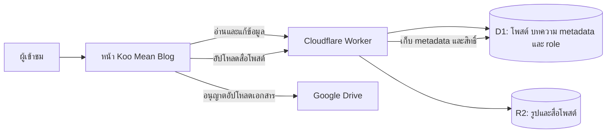

<div align="center">

# ✦ Koo Mean Blog

### พื้นที่แบ่งปันโพสต์และจัดการคลังบทความ


[ภาพรวม](#overview) · [ฟีเจอร์](#features) · [การทำงาน](#flow) · [ติดตั้ง](#setup) · [พัฒนา](#developer)

</div>

> เว็บนี้รวมฟีดโพสต์กับคลังบทความไว้ในหน้าเดียว ข้อมูลและสิทธิ์จัดการผ่าน Cloudflare Worker ส่วนไฟล์แต่ละประเภทเก็บในบริการที่เหมาะกับงาน

<a id="overview"></a>
## 🌟 ภาพรวม

หน้าเว็บคือ [`index koomeanblog.html`](index%20koomeanblog.html) เป็น HTML/CSS/JavaScript ในไฟล์เดียว จึงไม่ต้อง build ก่อนนำไปวางบน static hosting



Worker config อยู่ที่ [`../CloudFlare/wrangler.portal.jsonc`](../CloudFlare/wrangler.portal.jsonc) และใช้ `koomean-d1-worker.js` เป็น entry point ตาม config ใน repository ส่วน `koomeanproxy.txt` เป็นโค้ด proxy รุ่นเก่า ไม่ใช่ตัวที่ config นี้เลือกใช้

<a id="features"></a>
## ✨ ฟีเจอร์

| ส่วน | ทำอะไรได้ |
|---|---|
| **📝 โพสต์** | อ่านฟีด สร้าง/แก้ไข/ลบตามสิทธิ์ กด Like แสดงความคิดเห็น และแชร์โพสต์ |
| **🔎 ค้นพบเนื้อหา** | ค้นหาและกรองด้วย hashtag เปิดลิงก์ไปยังโพสต์หรือแท็กที่แชร์มา |
| **📚 คลังบทความ** | ค้นหาบทความตามชื่อ/แท็ก เปิดลิงก์หรือไฟล์ และจำกัดการเข้าถึงด้วย Group/role หรือรหัสผ่าน |
| **🖼️ สื่อ** | อัปโหลดรูป/สื่อของโพสต์ผ่าน Worker ไป R2 พร้อมสถานะการอัปโหลด |
| **👤 บัญชีและโปรไฟล์** | เข้าสู่ระบบด้วย Google และแสดงโปรไฟล์ของเว็บไซต์ |
| **🎨 รูปโปรไฟล์/พื้นหลัง** | แสดงรูป Blog ที่ผู้ดูแลจัดการผ่าน Admin Dashboard และเก็บผ่าน D1 |
| **💾 บันทึกส่วนตัว** | เก็บ draft, saved posts และค่าหน้าตาบางอย่างไว้ใน browser ของผู้ใช้ |
| **📊 โควตา R2** | ผู้ดูแลดูปริมาณใช้และสถานะการหยุดใช้งานตาม safe limit ได้จากหน้า Settings |

<a id="flow"></a>
## ⚙️ ระบบทำงานอย่างไร

1. หน้าเว็บส่งคำขอแบบ `POST` ไปยัง Worker เพื่อโหลดหรือเปลี่ยนข้อมูล
2. Worker ตรวจ Google ID token และ role เมื่อ action ต้องใช้ตัวตนหรือสิทธิ์
3. Worker อ่าน/เขียนข้อมูลโพสต์และ metadata บทความใน D1
4. สื่อโพสต์ส่งผ่าน Worker ไปเก็บใน R2
5. ไฟล์บทความที่เป็นเอกสารส่งไป Google Drive หลังผู้ดูแลให้สิทธิ์ Drive ที่หน้าเว็บร้องขอ

### 🗄️ ที่เก็บข้อมูล

| ข้อมูล | ที่เก็บ |
|---|---|
| โพสต์, ผู้ใช้/role, โปรไฟล์, metadata และสิทธิ์บทความ | Cloudflare D1 |
| รูปโปรไฟล์และพื้นหลังของเว็บ | D1 (`site_profile_images`) |
| รูปหรือสื่อที่แนบกับโพสต์ | Cloudflare R2 (`BLOG_ASSETS`) |
| ไฟล์บทความที่อัปโหลดเป็นเอกสาร | Google Drive |
| Draft, saved posts, theme และ cache บางส่วน | Browser storage ของผู้ใช้ |

<a id="setup"></a>
## 🚀 เริ่มต้นใช้งาน

### ☁️ เตรียมระบบหลังบ้าน

ตรวจ config ว่ามี D1 binding `DB`, R2 binding `BLOG_ASSETS`, database/bucket ถูกต้อง และ `ALLOWED_ORIGINS` มี origin ที่ใช้เผยแพร่เว็บ หาก schema ยังไม่พร้อม ให้นำ migration ที่เกี่ยวข้องไปใช้ก่อน

จากโฟลเดอร์ `CloudFlare` deploy Worker:

```bash
npx wrangler deploy --config wrangler.portal.jsonc
```

### 🌐 เผยแพร่หน้าเว็บ

1. นำ `index koomeanblog.html` ขึ้น HTTPS static hosting เช่น GitHub Pages หรือ Cloudflare Pages
2. ตรวจ `API_URL` ในไฟล์ให้ตรงกับ Worker ที่ต้องการใช้
3. เพิ่ม origin ของเว็บไซต์ใน Google OAuth Client → **Authorized JavaScript origins**
4. เพิ่ม origin เดียวกันใน `ALLOWED_ORIGINS` ของ Worker
5. ทดสอบจาก URL HTTPS จริง เพราะ `file://` ไม่ได้ใช้ origin แบบเว็บ production

> Origin คือ scheme + hostname (+ port ถ้ามี) เช่น `https://blog.example.com` ไม่รวม path ของไฟล์

## 📦 R2 และไฟล์บทความ

- `R2_QUOTA_RESET_DAY` กำหนดวันเริ่มรอบตาม config (ปัจจุบันตั้งเป็นวันที่ 11)
- Worker ตั้ง safe limit ไว้ที่ 80% ของ allowance ที่ใช้คำนวณ และหยุดเรียก R2 เมื่อถึงขีดจำกัดจนกว่าจะเริ่มรอบใหม่
- Guard นี้เป็นการควบคุมในแอป ไม่ใช่การตั้งเพดานบิลของ Cloudflare โดยตรง
- อัปโหลดเอกสารบทความต้องอนุญาต Google Drive scope ที่หน้าเว็บร้องขอ; บทความแบบ URL เก็บ metadata/URL ใน D1

<a id="developer"></a>
## 🧑‍💻 สำหรับผู้พัฒนา

- แก้ UI ใน `index koomeanblog.html`
- แก้ API, authorization หรือ schema integration ใน [`../CloudFlare/koomean-d1-worker.js`](../CloudFlare/koomean-d1-worker.js)
- แก้ bindings, cron และ origins ใน [`../CloudFlare/wrangler.portal.jsonc`](../CloudFlare/wrangler.portal.jsonc)
- หลังเพิ่มโดเมน ให้อัปเดต OAuth origins และ Worker CORS ให้สอดคล้องกัน
- ทดสอบอย่างน้อยทั้งบัญชีทั่วไปและ admin, สิทธิ์บทความ, การอัปโหลด R2 และ Drive

## 🔐 ความปลอดภัยและขอบเขต

- การซ่อนปุ่มใน browser ไม่ใช่การควบคุมสิทธิ์; Worker เป็นผู้ตรวจสิทธิ์จริง
- อย่า commit client secret, service-account key หรือ access token ลง repository
- Google OAuth Client ID เป็น public identifier สำหรับ frontend ไม่ใช่ secret
- เอกสารนี้อิง source/config ใน repository ไม่ได้ยืนยันว่า production deploy ใช้ revision เดียวกัน
